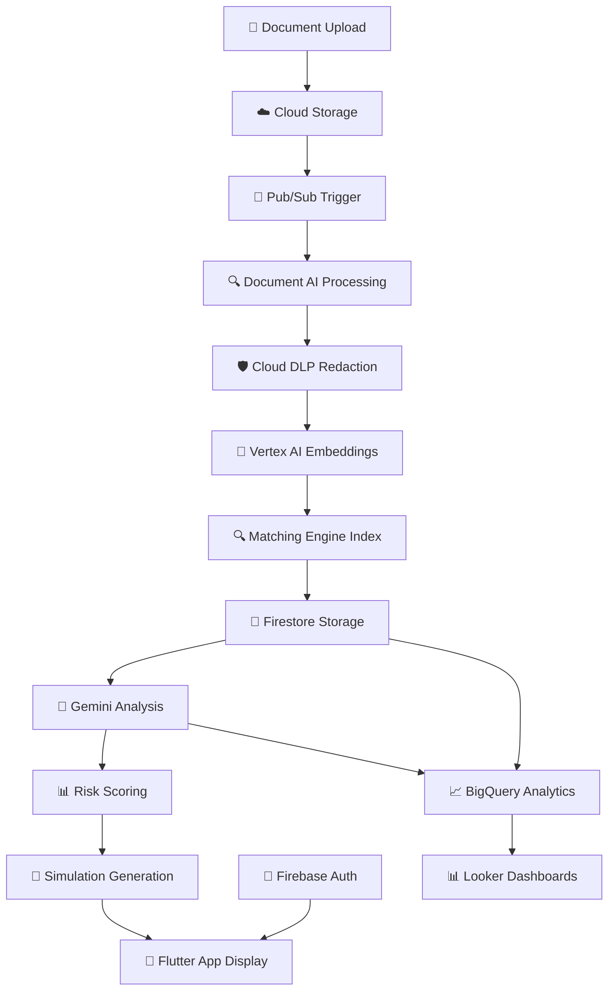
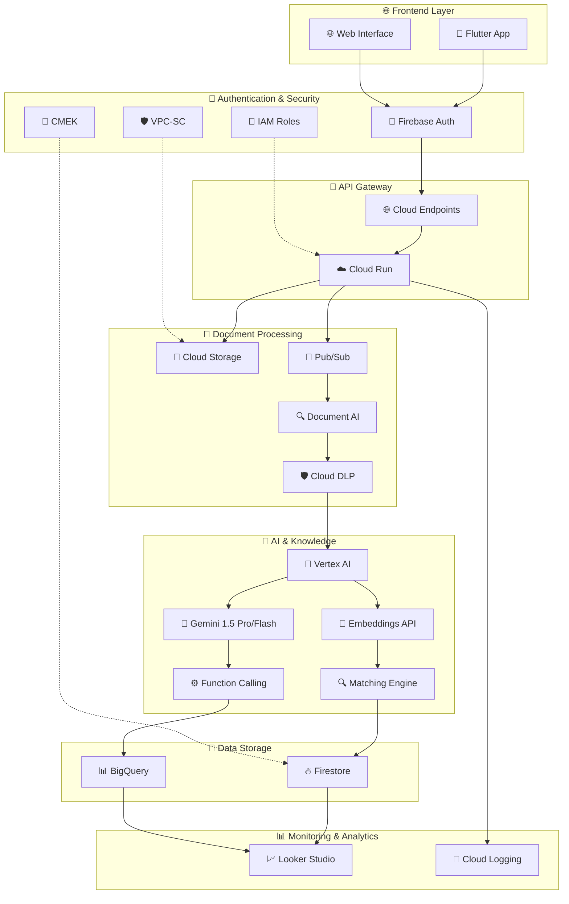
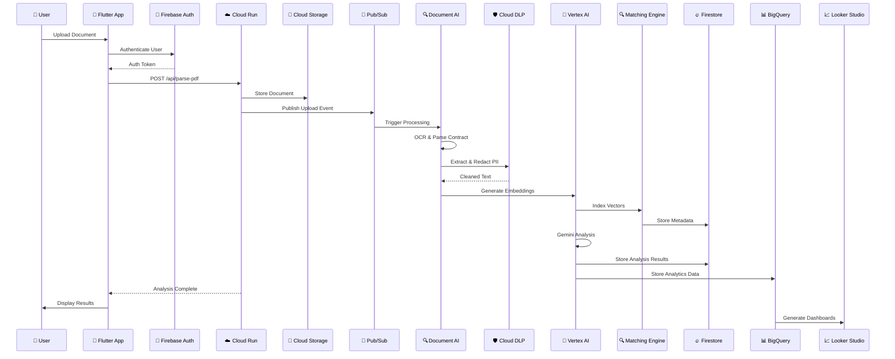
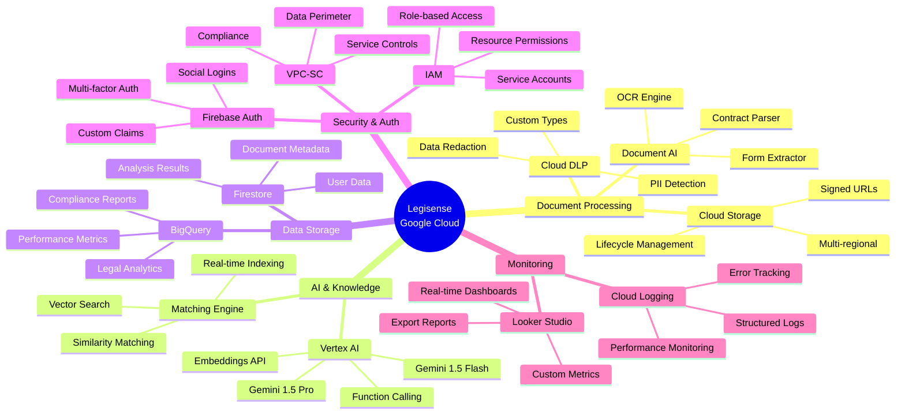

<div align="center">

# <strong>🌐 Legisense – AI‑Powered Legal Companion</strong>

[](https://flutter.dev)
[](https://www.djangoproject.com/)
[](https://www.python.org/)
[](#license)

</div>

---

## 🚨 Problem
- **Low legal literacy in India**: 70%+ struggle with legal jargon across everyday contracts (rentals, loans, insurance, ToS).
- **Hidden risks**: Users unknowingly accept auto‑renewals, penalties, and unfair clauses leading to disputes and losses.
- **Access gap**: SMEs, freelancers, tenants often can’t afford lawyers; billions lost annually to fraud/unfair terms.
- **Existing tools misaligned**: Solutions like Spellbook, DoNotPay, LawGeex, LegalZoom target lawyers/Western markets, not Indian citizens.

---

## 🌟 Vision
Build a trustworthy AI co‑pilot that makes legal documents:
- **Understandable**: Simplifies contracts into plain language.
- **Actionable**: Simulates what‑if outcomes and obligations.
- **Protective**: Flags hidden risks and unfair terms.
- **Empathetic**: Guides users with clarity, stress detection, and multilingual support.

---

## 💡 Solution — Legisense
An AI‑powered Legal Empathy & Simulation Companion that:
- **Simplifies** contracts into accessible language.
- **Analyzes** clauses, flags risks, and explains “why it matters”.
- **Simulates** real‑world outcomes (e.g., “Miss 2 EMIs → Default in 90 days → Foreclosure in 6 months”).
- **Adapts** to local laws (e.g., Karnataka vs Maharashtra eviction rules).
- **Supports** empathetically, detecting stress/confusion and adapting tone.
- **Guides action** with checklists, negotiation drafts, and links to NGOs/legal aid.

---

## 📱 App Structure (Pages)

### 🔹 Basic Pages
- **Home Page**: Quick insights, recent documents, alerts, and central “Upload Document” button.
- **Documents Page**: List of uploads → open in Display (abstract text view) or Analysis (risk & summaries).
- **Profile Page**: History, saved simulations, preferences (readability level, languages, privacy).
- **Simulation Page (Entry)**: Hub to run what‑if contract simulations.

### 🔹 Document Analyzer
- **Document Display Page**: Extracted text + original scans with highlighting and search.
- **Document Analysis Page**: Clause explanations, red‑flag alerts, risk scoring, checklists, and Q&A with citations.

### 🔹 Document Simulation
- **Simulation Overview Page**: Topic grid (obligations, penalties, exits, comparative, jurisdiction, forecasts) + what‑if toggles.
- **Simulation Details Page**: Interactive flowchart + timeline of obligations and outcomes.
- **Enhanced Simulation Page**: Rich scenario inputs, jurisdiction filters, narrative outcomes, contextual risk alerts, export/save.

---

## ⚙️ Technical Flow (5 Layers)

### 📊 Processing Pipeline Flowchart


### 🏗️ Google Cloud Architecture Diagram


### 🔄 Layer-by-Layer Breakdown
- **Ingestion**: Upload → Cloud Storage → Pub/Sub trigger → metadata extraction
- **Preprocessing**: Document AI (OCR/parsing) → Cloud DLP (PII redaction) → clean text → clause detection
- **Analysis**: Vertex AI Embeddings → Matching Engine → Gemini 1.5 Pro/Flash → summaries, risks, Q&A
- **Application Logic**: Function Calling → Clause Explorer, Red‑Flag Reports, What‑If Simulation, Checklists
- **User Layer**: Firebase Auth → Flutter app → Home, Documents, Analyzer, Simulation, Profile

### 🏗️ Architecture Notes
- **Current OSS stack (this repo)**: Flutter app (`legisense/`) + Django API (`legisense_backend/`)
- **Production cloud architecture**: Google Cloud (Cloud Run, Firestore, Document AI, Vertex AI) for scale‑out
- **Serverless design**: Auto-scaling, pay-per-use, event-driven processing

---

## ☁️ Google Cloud Tools & Services

### 📄 1. Document Ingestion & Processing

| Service | Purpose | Key Features |
|---------|---------|--------------|
| **Google Cloud Storage (GCS)** | Store uploaded PDFs, DOCX, images | • Multi-regional storage<br>• Lifecycle management<br>• Signed URLs for secure access |
| **Cloud Run** | API layer for upload, preprocessing, analysis orchestration | • Serverless containers<br>• Auto-scaling (0-1000 instances)<br>• Pay-per-request pricing |
| **Cloud Pub/Sub** | Event-driven pipeline trigger | • Asynchronous processing<br>• Guaranteed delivery<br>• Dead letter queues |

### 🔍 2. Document Parsing & Cleaning

| Service | Purpose | Key Features |
|---------|---------|--------------|
| **Document AI (DocAI)** | OCR, Contract Parser, Form Extractor | • Contract-specific parsing<br>• Entity extraction (dates, amounts, parties)<br>• Form field detection |
| **Cloud DLP** | Detect & redact sensitive data | • PII detection (Aadhaar, PAN, names)<br>• Custom data types<br>• De-identification templates |

### 🧠 3. Knowledge & Retrieval

| Service | Purpose | Key Features |
|---------|---------|--------------|
| **Vertex AI Embeddings** | Convert document clauses into semantic vectors | • Text embedding models<br>• Multi-language support<br>• Batch processing |
| **Vertex AI Matching Engine** | ANN-based search for clause retrieval | • Vector similarity search<br>• Real-time indexing<br>• Filtering capabilities |
| **BigQuery** | Store structured legal data for analytics | • SQL-based queries<br>• Real-time analytics<br>• ML integration |
| **Firestore** | Store user metadata, doc metadata, analysis results | • NoSQL document store<br>• Real-time updates<br>• Offline support |

### 🤖 4. Reasoning & Generative AI

| Service | Purpose | Key Features |
|---------|---------|--------------|
| **Vertex AI Gemini 1.5 Pro** | Deep analysis, risk scoring, simulation generation | • 1M+ token context<br>• Multimodal capabilities<br>• Function calling |
| **Vertex AI Gemini 1.5 Flash** | Quick summaries, real-time Q&A, UX responsiveness | • Fast inference<br>• Cost-effective<br>• Streaming responses |
| **Vertex AI Function Calling** | Tools for legal analysis functions | • `extract_clauses()`<br>• `score_risk()`<br>• `simulate_outcomes()`<br>• `generate_checklist()` |

### 🔐 5. Application & Security

| Service | Purpose | Key Features |
|---------|---------|--------------|
| **Firebase Auth / Identity Platform** | Secure login (email, phone, OAuth) | • Multi-factor authentication<br>• Social logins<br>• Custom claims |
| **Cloud Endpoints / API Gateway** | Manage API requests securely | • Rate limiting<br>• API key management<br>• Request/response logging |
| **VPC-SC (Service Controls)** | Network-level isolation of sensitive data | • Data perimeter security<br>• Service-to-service controls<br>• Compliance boundaries |
| **CMEK (Customer-Managed Encryption Keys)** | User-controlled encryption | • Key rotation<br>• Audit logging<br>• Compliance support |
| **IAM (Identity & Access Management)** | Least privilege access for roles | • Role-based access control<br>• Service accounts<br>• Resource-level permissions |

### 📊 6. Monitoring & Analytics

| Service | Purpose | Key Features |
|---------|---------|--------------|
| **Looker Studio + BigQuery** | Dashboards for evaluation, performance monitoring | • Real-time dashboards<br>• Custom metrics<br>• Export capabilities |
| **Cloud Logging** | Centralized logging and monitoring | • Structured logging<br>• Log-based metrics<br>• Error reporting |

### 💰 Cost Optimization Strategy

| Layer | Service | Cost Model | Optimization |
|-------|---------|------------|--------------|
| **Storage** | Cloud Storage | $0.020/GB/month | Lifecycle policies, compression |
| **Processing** | Cloud Run | $0.40/vCPU-hour | Auto-scaling, cold starts |
| **AI/ML** | Vertex AI | $0.50/1M tokens | Caching, batch processing |
| **Database** | Firestore | $0.18/100K reads | Query optimization, indexing |
| **Analytics** | BigQuery | $5/TB processed | Partitioning, clustering |

### 🔄 Data Flow Architecture



### 🏗️ Service Integration Map



---

## 🔑 Features
- **Plain‑Language Summaries**: 3 levels — basic, standard, detailed.
- **Clause Explorer**: Risks, why‑it‑matters, suggested actions.
- **Red‑Flag Report**: Sorted by severity.
- **Contract‑to‑Life Simulation**: Obligations → breaches → consequences.
- **Jurisdiction‑Aware Guidance**: State‑level rules.
- **Empathetic Support**: Stress detection, adaptive tone, resources.
- **Actionable Guidance**: Checklists, draft letters, connect to aid.
- **Multilingual**: English ↔ Hindi/Marathi.
- **Privacy Controls**: Ephemeral mode, local redaction.

---

## 🚀 Why Unique (Differentiation)

| Existing Tools (Spellbook, LawGeex, DoNotPay, LegalZoom) | Legisense |
| --- | --- |
| Lawyer‑focused, Western markets | Citizen‑first, India‑first |
| Reactive: Summarization & review | Proactive: Simulation & empathy |
| Expensive ($15–20/doc avg) | Affordable (~$3–4/doc) |
| English‑heavy, complex UI | Multilingual, mobile‑first, simple |
| No emotional support | Empathetic + stress‑aware guidance |

---

## 📊 Feasibility, Scalability, Viability
- **Feasibility**: Serverless GCP reference (Cloud Run, Firestore, Document AI, Vertex AI); MVP in 6–8 weeks.
- **Scalability**: Serverless infra auto‑scales; cost grows with usage.
- **Viability**: Freemium (free summary + red flags; paid simulations). Low processing cost (~$0.30–0.50/doc).
- **Market Opportunity**: India → 500M+ smartphone users; 70% low legal literacy.
- **Sustainability**: Efficient infra, caching, reuse, green defaults.

---

## 📈 Impact
- **Prevents fraud & unfair penalties** → saves billions annually.
- **Reduces legal burden** for SMEs, freelancers, tenants.
- **Increases access to justice** for citizens without lawyers.
- **Empowers with foresight** via simulations of obligations.
- **Improves legal literacy** through plain explanations and scenarios.

---

## 💰 Implementation Cost (Lean MVP)
- **Storage + Hosting**: 20%
- **Document AI Parsing**: 25%
- **AI Analysis**: 30%
- **Database (Firestore/BigQuery)**: 10%
- **Security + Compliance**: 10%
- **Misc (APIs, logs)**: 5%

➡️ Estimated cost per doc: **$3–4** vs **$15–20** for enterprise tools.

---

## 🔗 Quick Links
- **Frontend (Flutter)**: `legisense/`
- **Backend (Django)**: `legisense_backend/`
- **Design Prototypes**: `prototype_design/`

---

## 🚀 Getting Started

### Prerequisites
- Docker Desktop (Windows/Mac) or Docker Engine (Linux)
- Git

### Quick Start with Docker (Recommended)

#### 1. Clone and Setup
```bash
git clone <your-repository-url>
cd legisense
cp env.example .env
```

#### 2. Start Development Environment
```bash
# On Windows
scripts\docker-dev.bat start

# On Linux/Mac
./scripts/docker-dev.sh start
```

#### 3. Access Your Application
- **Frontend**: http://localhost:8080
- **Backend API**: http://localhost:8000/api/
- **Admin Panel**: http://localhost:8000/admin/

#### 4. Create Admin User
```bash
# On Windows
scripts\docker-dev.bat superuser

# On Linux/Mac
./scripts/docker-dev.sh superuser
```

### Production Deployment
```bash
# Configure environment
nano .env  # Set DEBUG=false, secure SECRET_KEY, and API keys

# Start production
scripts\docker-prod.bat start  # Windows
./scripts/docker-prod.sh start  # Linux/Mac
```

### Manual Setup (Alternative)

#### Prerequisites
- Flutter 3.22+ (Dart 3)
- Python 3.10+

#### 1) Backend (Django)
```bash
cd legisense_backend
python -m venv venv
# Windows
venv\Scripts\activate
# macOS/Linux
# source venv/bin/activate

pip install -r requirements.txt
python manage.py migrate
python manage.py runserver 0.0.0.0:8000
```
Backend runs at `http://localhost:8000` (Android emulator uses `http://10.0.2.2:8000`).

#### 2) Frontend (Flutter)
```bash
cd legisense
flutter pub get
flutter run
```

Web/Desktop example:
```bash
flutter run --dart-define=LEGISENSE_API_BASE=http://localhost:8000
```

---

## 🐳 Docker Architecture (Development)

The application is fully containerized with the following services for local development:

```
┌─────────────────┐    ┌─────────────────┐    ┌─────────────────┐
│   Flutter Web   │    │  Django Backend │    │   PostgreSQL    │
│   (Frontend)    │◄──►│   (API Server)  │◄──►│   (Database)    │
│   Port: 8080    │    │   Port: 8000    │    │   Port: 5432    │
└─────────────────┘    └─────────────────┘    └─────────────────┘
                                │
                                ▼
                       ┌─────────────────┐
                       │     Redis       │
                       │   (Cache)       │
                       │   Port: 6379    │
                       └─────────────────┘
```

> **Note**: For production deployment, see the [Google Cloud Architecture](#️-technical-flow-5-layers) section above, which provides serverless, auto-scaling infrastructure with Document AI, Vertex AI, and other Google Cloud services.

### Docker Services
- **Frontend**: Flutter web app with Nginx
- **Backend**: Django with Gunicorn
- **Database**: PostgreSQL with initialization
- **Cache**: Redis for sessions and caching
- **Proxy**: Nginx for production load balancing

### Management Scripts
- `scripts/docker-dev.bat` (Windows) / `scripts/docker-dev.sh` (Linux/Mac) - Development management
- `scripts/docker-prod.bat` (Windows) / `scripts/docker-prod.sh` (Linux/Mac) - Production management

### Common Docker Commands
```bash
# Development
scripts\docker-dev.bat start      # Start development environment
scripts\docker-dev.bat logs       # View logs
scripts\docker-dev.bat migrate    # Run database migrations
scripts\docker-dev.bat stop       # Stop services
scripts\docker-dev.bat cleanup    # Clean up resources

# Production
scripts\docker-prod.bat start     # Start production environment
scripts\docker-prod.bat monitor   # Monitor services
scripts\docker-prod.bat backup    # Backup database
scripts\docker-prod.bat scale 3 2 # Scale services
```

---

## ⚙️ Configuration
Flutter app reads the backend base URL via a compile‑time define:

| Var | Default | Notes |
| --- | --- | --- |
| `LEGISENSE_API_BASE` | `http://10.0.2.2:8000` | Default for Android emulators. Use `http://localhost:8000` for local web/desktop. |

---

## 🧩 Key Code Paths
- **App entry & shell**: `legisense/lib/main.dart`
  - `SafeArea` wrapping
  - `IndexedStack` + global bottom nav
- **Nav bar**: `legisense/lib/components/bottom_nav_bar.dart`
- **Documents**:
  - Page: `legisense/lib/pages/documents/documents_page.dart`
  - Analysis (polling fallback): `legisense/lib/pages/documents/document_analysis.dart`
  - Repository (HTTP): `legisense/lib/api/parsed_documents_repository.dart`
- **Simulation**: `legisense/lib/pages/simulation/`
- **Notifications**: `legisense/lib/pages/notifications/notifications_page.dart`
- **Theme helpers**: `legisense/lib/theme/app_theme.dart`
- **Responsive helpers**: `legisense/lib/utils/responsive.dart`

---

## 🧪 Backend Endpoints (high level)
- `GET /api/documents/` — list documents
- `GET /api/documents/{id}/` — document detail
- `GET /api/documents/{id}/analysis/` — analysis JSON
- `POST /api/parse-pdf/` — upload and parse a PDF

---

## 🛠️ Development Notes
- Prefer `Color.withValues(alpha: ...)` (replaces deprecated `withOpacity()`).
- Notifications page uses a responsive header and persistent bottom nav.
- Global navigation helper: `navigateToPage(int index)` in `main.dart`.

---

## 🖼️ Screenshots
Add screenshots/GIFs into `assets/` and update paths:

| Home | Documents | Notifications |
| :--: | :-------: | :-----------: |
|  |  |  |

---

## 🗺️ Roadmap
- [ ] Authentication & user sessions
- [ ] Persistent notifications & settings
- [ ] Real‑time progress for long parses
- [ ] Role‑based access and sharing

---

## 📦 Build

### Docker Build
```bash
# Development build
docker-compose -f docker-compose.dev.yml build

# Production build
docker-compose build
```

### Manual Build
```bash
# Android
flutter build apk

# iOS
flutter build ios

# Web
flutter build web
```

---

## 🧯 Troubleshooting

### Docker Issues
- **Port already in use**: Check what's using the port with `netstat -ano | findstr :8080` and kill the process
- **Services not starting**: Check logs with `scripts\docker-dev.bat logs`
- **Database issues**: Reset with `scripts\docker-dev.bat cleanup` then `scripts\docker-dev.bat start`
- **Permission issues**: Ensure Docker has proper permissions and restart Docker Desktop

### General Issues
- **Android networking**: use `http://10.0.2.2:8000` for the emulator.
- **Analysis 404 initially**: UI polls for ~30s, then shows a friendly message.
- **Overlap with status bar**: ensure `SafeArea` wraps page bodies (already applied).

---

## ✅ In Summary

**Legisense** is a citizen‑first, India‑first legal AI companion that not only explains contracts but also simulates consequences, adapts to local laws, and supports users empathetically — bridging a major access‑to‑justice gap while remaining feasible, scalable, and affordable.

### 🏗️ Architecture Summary

| Layer | Technology Stack | Purpose |
|-------|------------------|---------|
| **Frontend** | Flutter (Cross-platform) | Mobile-first, responsive UI |
| **Backend** | Django + Cloud Run | API orchestration, business logic |
| **Document Processing** | Document AI + Cloud DLP | OCR, parsing, PII redaction |
| **AI/ML** | Vertex AI (Gemini 1.5) | Analysis, simulation, Q&A |
| **Storage** | Firestore + BigQuery | User data, analytics, knowledge base |
| **Security** | Firebase Auth + IAM | Authentication, authorization |
| **Monitoring** | Looker Studio + Cloud Logging | Dashboards, performance tracking |

### 🚀 Key Differentiators

- **🇮🇳 India-First**: Built for Indian legal system, languages, and user needs
- **🤖 AI-Powered**: Advanced document analysis with Gemini 1.5 Pro/Flash
- **📊 Simulation Engine**: What-if scenarios for contract outcomes
- **🛡️ Privacy-Focused**: Local processing options, PII redaction
- **💰 Cost-Effective**: ~$3-4 per document vs $15-20 for enterprise tools
- **📱 Mobile-First**: Flutter app for maximum accessibility

---

## 📄 License
MIT — see the `LICENSE` file (if not present, feel free to add one).
