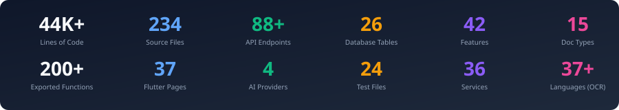
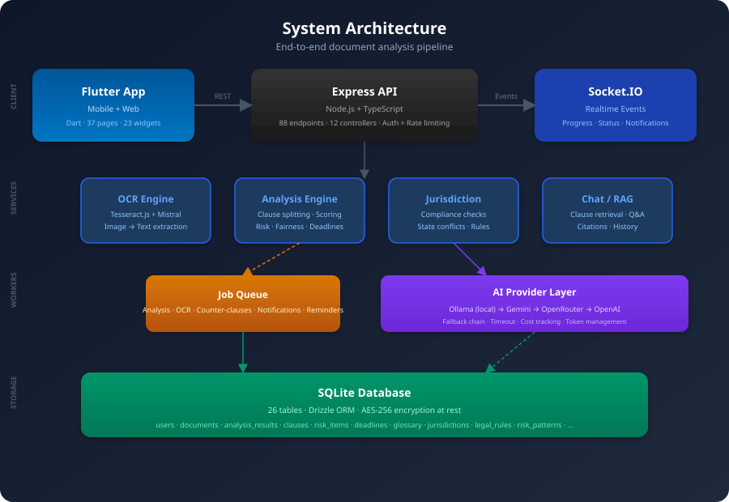
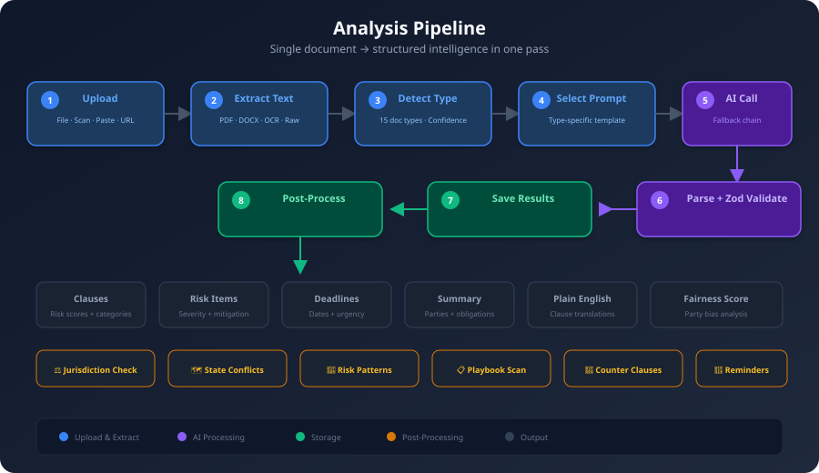
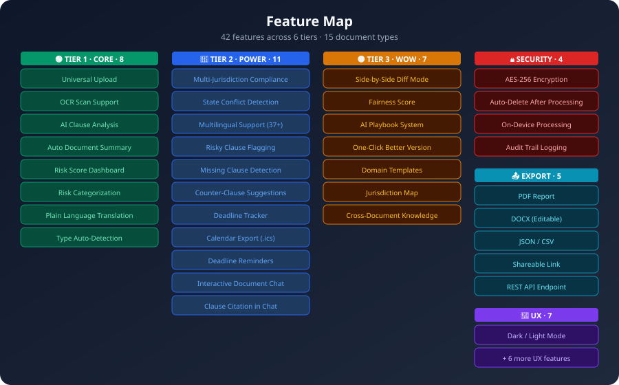
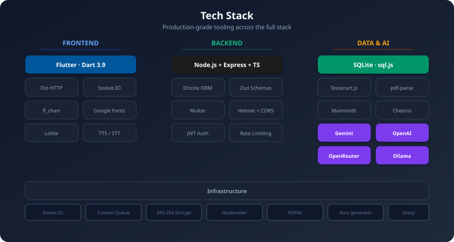
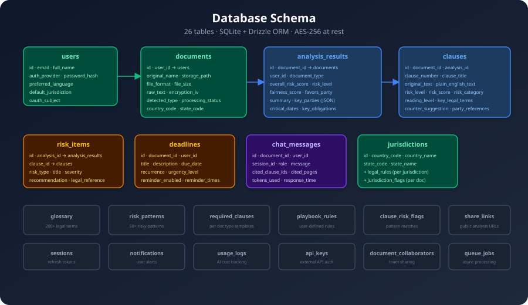
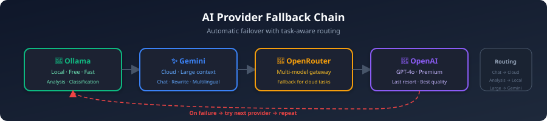

<p align="center">
  
</p>

<h1 align="center">⚖️ LegiSense</h1>

<p align="center">
  <strong>AI-Powered Legal Document Intelligence Platform</strong><br/>
  <em>Upload any legal document → clause-by-clause analysis → risk scoring → plain-English translation</em>
</p>

<p align="center">
  
  
  
  
  
</p>

<p align="center">
  <a href="#-quick-start">Quick Start</a> ·
  <a href="#-architecture">Architecture</a> ·
  <a href="#-analysis-pipeline">Pipeline</a> ·
  <a href="#-features">Features</a> ·
  <a href="#-tech-stack">Tech Stack</a> ·
  <a href="#-api-reference">API</a> ·
  <a href="#-testing">Tests</a>
</p>

---

## 🚀 Quick Start

### Prerequisites

- **Node.js** ≥ 20
- **Flutter** ≥ 3.9 (for mobile/web app)
- **Ollama** (optional, for local AI — free tier)

### Backend

```bash
cd backend
cp .env.example .env        # configure API keys
npm install
npm run dev                  # http://localhost:3001
```

### App

```bash
cd app
flutter pub get
flutter run
```

### Verify

```bash
curl http://localhost:3001/health
# → {"status":"ok","service":"legisense-backend","timestamp":"..."}
```

---

## 🏗️ Architecture

<p align="center">
  
</p>

| Layer | Technology | Purpose |
|-------|-----------|---------|
| **Client** | Flutter (Dart) | Cross-platform mobile + web UI — 37 pages, 23 widgets |
| **API** | Express + TypeScript | 88 REST endpoints, JWT auth, rate limiting, CORS |
| **Services** | 36 service modules | Analysis, OCR, jurisdiction, chat, deadlines, encryption |
| **Workers** | Custom queue (SQLite-backed) | Async jobs: analysis, OCR, counter-clauses, notifications |
| **AI** | 4 providers with fallback | Ollama → Gemini → OpenRouter → OpenAI |
| **Storage** | SQLite + Drizzle ORM | 26 tables, AES-256 encryption at rest |
| **Realtime** | Socket.IO | Progress events, status updates, notifications |

---

## 📊 Analysis Pipeline

<p align="center">
  
</p>

**One AI call produces everything** — clauses, risk scores, summary, deadlines, fairness analysis, plain-English translations, and breach scenarios. No separate API calls per feature.

### Pipeline Steps

| Step | Component | Description |
|------|-----------|-------------|
| 1 | **Upload** | File / Camera scan / Paste text / URL import |
| 2 | **Extract** | PDF → pdf-parse, DOCX → mammoth, Images → Tesseract.js OCR |
| 3 | **Detect** | Auto-classify into 15 document types (NDA, Lease, Employment…) |
| 4 | **Prompt** | Select type-specific analysis prompt from 15 templates |
| 5 | **AI Call** | Send to provider with fallback chain + 55s timeout |
| 6 | **Parse** | Zod schema validation with soft coercion for local models |
| 7 | **Save** | Persist to SQLite: analysis_results, clauses, risk_items, deadlines |
| 8 | **Post** | Jurisdiction check, risk patterns, playbook scan, counter-clauses |

### Output Tables

| Table | Records | Description |
|-------|---------|-------------|
| `clauses` | Per document | Numbered clauses with risk scores, plain English, legal terms |
| `risk_items` | 3-8 per doc | Named risks with severity, recommendation, legal reference |
| `deadlines` | Extracted dates | Due dates with urgency, recurrence, reminders |
| `analysis_results` | 1 per doc | Summary, parties, obligations, fairness score, breach scenarios |

---

## ✨ Features

<p align="center">
  
</p>

### 🟢 Core (8 features)

| Feature | Description |
|---------|-------------|
| **Universal Upload** | PDF, DOCX, TXT, images, copy-paste, URL import |
| **OCR Scan** | Photograph physical documents — Tesseract.js + Mistral fallback |
| **AI Clause Analysis** | Clause-by-clause breakdown with risk scoring |
| **Auto Summary** | Parties, obligations, critical dates, breach scenarios |
| **Risk Dashboard** | 0-100 score with color-coded visual gauge |
| **Risk Categories** | Financial, legal, privacy, termination, liability, compliance |
| **Plain Language** | "What you're actually signing" — legalese to English |
| **Type Detection** | Auto-detect 15 document types with confidence score |

### 🔵 Power (11 features)

| Feature | Description |
|---------|-------------|
| **Jurisdiction Compliance** | Country → State law violation detection |
| **State Conflicts** | Same clause legal in one state, void in another |
| **Multilingual** | 37+ languages via AI translation layer |
| **Risky Clause Flagging** | 50+ seeded risk patterns with keyword matching |
| **Missing Clause Detection** | Flags absent protections per document type |
| **Counter-Clause Suggestions** | AI rewrites risky clauses to be fairer |
| **Deadline Tracker** | Auto-extract renewal, notice, payment dates |
| **Calendar Export** | .ics file generation for deadline import |
| **Deadline Reminders** | Email/push notifications before critical dates |
| **Document Chat** | RAG-based Q&A with cited clause references |
| **Clause Citation** | Every AI answer references exact section numbers |

### 🟡 Wow (7 features)

| Feature | Description |
|---------|-------------|
| **Fairness Score** | "This contract favors the Landlord at 78/100" |
| **AI Playbook** | Save personal rules like "Never accept non-compete > 1 year" |
| **Better Version** | AI generates a fairer rewrite of the entire document |
| **Domain Templates** | 15 type-specific analysis templates |
| **Cross-Document Knowledge** | Reference past uploads for context |
| **Side-by-Side Diff** | Compare V1 vs V2 document versions |
| **Jurisdiction Map** | Interactive state selection for law-specific analysis |

### 🔒 Security & Export (9 features)

| Feature | Description |
|---------|-------------|
| **AES-256 Encryption** | Documents encrypted at rest with per-file keys |
| **Auto-Delete** | Documents wiped after processing for privacy |
| **Audit Trail** | Usage logging with cost tracking per AI call |
| **PDF/DOCX Export** | Downloadable analysis reports |
| **JSON/CSV Export** | Developer-friendly formats |
| **Shareable Links** | One-click share analysis with your lawyer |
| **REST API** | Programmatic access via API key authentication |
| **Dark/Light Mode** | Theme toggle across the app |
| **Onboarding** | First-time user guided walkthrough |

---

## 🛠️ Tech Stack

<p align="center">
  
</p>

### Frontend — Flutter

| Package | Purpose |
|---------|---------|
| `dio` | HTTP client with interceptors + auto-refresh |
| `socket_io_client` | Real-time progress events |
| `fl_chart` | Risk gauge, bar charts, trend graphs |
| `google_fonts` | Plus Jakarta Sans design system |
| `lottie` | Splash animation |
| `flutter_tts` / `speech_to_text` | Read-aloud + voice input |
| `image_picker` / `file_picker` | Camera scan + file upload |
| `google_sign_in` | OAuth authentication |
| `share_plus` | Share reports to other apps |
| `url_launcher` | Open links in browser |

### Backend — Node.js

| Package | Purpose |
|---------|---------|
| `express` + `helmet` + `cors` | HTTP framework + security |
| `drizzle-orm` + `sql.js` | SQLite ORM with in-memory DB |
| `zod` | Request + AI response validation |
| `tesseract.js` | Local OCR engine |
| `pdf-parse` / `mammoth` | PDF + DOCX text extraction |
| `sharp` | Image preprocessing (HEIC → JPEG) |
| `socket.io` | WebSocket server |
| `bcrypt` + `jsonwebtoken` | Password hashing + JWT auth |
| `nodemailer` | Email notifications |
| `pdfkit` / `docx` | Report generation |
| `cheerio` | URL content scraping |
| `franc-min` | Language detection |
| `@google/generative-ai` | Gemini API client |
| `openai` | OpenAI API client |

---

## 🗄️ Database

<p align="center">
  
</p>

### Core Tables

| Table | Purpose | Key Columns |
|-------|---------|-------------|
| `users` | User accounts | email, auth_provider, preferred_language, default_jurisdiction |
| `documents` | Uploaded files | storage_path, raw_text, detected_type, processing_status |
| `analysis_results` | AI output | overall_risk_score, fairness_score, summary, key_parties |
| `clauses` | Per-clause data | risk_score, plain_english_text, reading_level, counter_suggestion |
| `risk_items` | Identified risks | severity, recommendation, legal_reference |
| `deadlines` | Extracted dates | due_date, recurrence, urgency_level, reminder_enabled |

### Reference Tables

| Table | Records | Purpose |
|-------|---------|---------|
| `glossary` | 200+ terms | Legal term definitions |
| `jurisdictions` | Countries + states | Multi-jurisdiction compliance |
| `legal_rules` | Per jurisdiction | Applicable law rules |
| `risk_patterns` | 50+ patterns | Risky clause keyword matching |
| `required_clauses_templates` | Per doc type | Missing clause detection |

---

## 🔌 API Reference

### Authentication

```
POST /api/auth/register       Create account
POST /api/auth/login          Get JWT tokens
POST /api/auth/refresh-token  Refresh expired access token
GET  /api/auth/google         Google OAuth redirect
```

### Documents

```
POST   /api/documents/upload          Upload file/scan/paste/URL
GET    /api/documents                  List user documents
GET    /api/documents/:id             Get document details
POST   /api/documents/:id/process     Start analysis (blocking)
DELETE /api/documents/:id             Soft-delete document
```

### Analysis

```
POST /api/analysis/start/:documentId       Queue analysis (async)
GET  /api/analysis/:documentId             Get full analysis bundle
GET  /api/analysis/:documentId/clauses     List clauses
GET  /api/analysis/:documentId/risks       List risk items
GET  /api/analysis/:documentId/summary     Get summary
GET  /api/analysis/:documentId/plain-english  Plain language view
GET  /api/analysis/:documentId/risk-dashboard  Dashboard data
GET  /api/analysis/:documentId/jurisdiction-flags  Compliance flags
GET  /api/analysis/:documentId/state-conflicts  Cross-state conflicts
GET  /api/analysis/:documentId/flagged-clauses  Risk pattern matches
GET  /api/analysis/:documentId/missing-clauses  Absent protections
GET  /api/analysis/:documentId/counter-clauses  AI fairer alternatives
POST /api/analysis/:documentId/confirm-type  Override detected type
POST /api/analysis/glossary              Legal term lookup
```

### Chat

```
POST /api/chat/message              Send message (RAG)
GET  /api/chat/history/:documentId  Get chat history
```

### Deadlines

```
GET  /api/deadlines              List all deadlines
GET  /api/deadlines/upcoming     Upcoming deadlines
PUT  /api/deadlines/:id/complete  Mark deadline done
POST /api/deadlines/export/ics   Generate .ics file
```

### Other

```
GET  /api/notifications/settings     User notification prefs
PUT  /api/notifications/settings     Update prefs
GET  /api/jurisdictions/countries    List countries
GET  /api/jurisdictions/:country/states  List states
POST /api/languages/translate        Translate analysis
GET  /api/documents/:id/export       Export as PDF/DOCX/JSON/CSV
```

---

## 🤖 AI Providers

<p align="center">
  
</p>

### Provider Selection Logic

| Task | Preferred Provider | Reason |
|------|-------------------|--------|
| **Analysis** | Ollama (local) → Gemini | Free tier, large context |
| **Chat / Rewrite** | Gemini → OpenRouter | Best reasoning, cloud |
| **Multilingual** | Gemini | Best multilingual support |
| **Classification** | Any available | Lightweight task |
| **Large docs (>100K tokens)** | Gemini | 1M+ token context window |

### Fallback Behavior

1. Primary provider called with 55s timeout
2. On failure → next available provider in chain
3. All providers exhausted → heuristic clause splitting (no AI)
4. Quota exceeded → skip retry, use cached/heuristic results

---

## 🧪 Testing

```bash
# Run all tests
cd backend
npm run test:all

# Individual test suites
npm run test:models          # Data model validation
npm run test:middleware      # Auth, CORS, rate limiting
npm run test:pipeline        # Analysis pipeline
npm run test:auth            # JWT, OAuth, sessions
npm run test:documents       # Upload, CRUD, export
npm run test:queue-upgrade   # Queue system
npm run test:socket          # Realtime events
npm run test:services        # Service integration
npm run test:chunk           # Document chunking
npm run test:jurisdiction    # Jurisdiction + language
npm run test:f12-f15         # Flagged/missing/counter clauses
npm run test:f16-f19         # Deadlines/export

# Type checking
npm run typecheck
```

---

## 📁 Project Structure

```
legisense/
├── app/                          # Flutter (Dart)
│   ├── lib/
│   │   ├── main.dart             # App entry
│   │   ├── config/               # API config, constants
│   │   ├── data/                 # Mock data, auth constants
│   │   ├── mappers/              # API → UI model mappers
│   │   ├── models/               # Pending upload, API models
│   │   ├── pages/                # 37 pages across 13 features
│   │   │   ├── analysis/         # Results, summary, risk, clauses
│   │   │   ├── auth/             # Login, register, OTP, password
│   │   │   ├── chat/             # Document Q&A
│   │   │   ├── deadlines/        # Deadline management
│   │   │   ├── documents/        # Document list
│   │   │   ├── home/             # Dashboard
│   │   │   ├── notifications/    # Alert center
│   │   │   ├── profile/          # User settings
│   │   │   ├── shell/            # Bottom nav + tab routing
│   │   │   ├── splash/           # Launch screen
│   │   │   └── upload/           # File/scan/paste/URL
│   │   ├── repositories/         # 8 data repositories
│   │   ├── services/             # API client, socket, TTS, auth
│   │   ├── theme/                # Design system (colors, radii, shadows)
│   │   ├── utils/                # Export, validators, formatters
│   │   └── widgets/              # 23 reusable widgets
│   └── assets/                   # Images, Lottie animations
│
├── backend/                      # Node.js + Express + TypeScript
│   ├── src/
│   │   ├── index.ts              # Server entry + migrations
│   │   ├── app.ts                # Express app + routes
│   │   ├── config/               # Database, languages
│   │   ├── controllers/          # 12 request handlers
│   │   ├── data/                 # Seed data, glossary, jurisdictions
│   │   ├── jobs/                 # Analysis worker
│   │   ├── middleware/           # Auth, CORS, rate limit, validation
│   │   ├── models/               # 27 Drizzle table schemas
│   │   ├── prompts/              # 5 prompt builders + 15 type templates
│   │   ├── queue/                # Custom SQLite-backed job queue
│   │   ├── routes/               # 10 route modules
│   │   ├── schemas/              # Zod validation schemas
│   │   ├── services/             # 36 service modules
│   │   │   └── ai/               # 4 AI providers + fallback chain
│   │   ├── storage/              # File I/O (local filesystem)
│   │   ├── types/                # TypeScript type definitions
│   │   └── utils/                # Error classes, helpers
│   ├── tests/                    # 24 test files
│   └── data/                     # SQLite database file
│
└── docs/                         # Documentation + diagrams
    └── diagrams/                 # SVG architecture diagrams
```

---

## 🔧 Configuration

### Environment Variables

```bash
# Backend (.env)
JWT_SECRET=your-secret-key
JWT_ACCESS_EXPIRES_IN=900        # 15 minutes
JWT_REFRESH_EXPIRES_IN=2592000   # 30 days

# AI Providers (set at least one)
OLLAMA_ENABLED=true
OLLAMA_MODEL=llama3.2

GEMINI_API_KEY=your-gemini-key
OPENROUTER_API_KEY=your-openrouter-key
OPENAI_API_KEY=your-openai-key

# Optional
ENCRYPTION_KEY=your-256-bit-key  # AES-256 at rest
SMTP_HOST=smtp.example.com
SMTP_PORT=587
SMTP_USER=your@email.com
SMTP_PASS=your-password
```

---

## 📄 License

MIT — see [`LICENSE`](LICENSE).

---

<p align="center">
  <strong>Built with ❤️ for making legal documents understandable by everyone.</strong>
</p>
